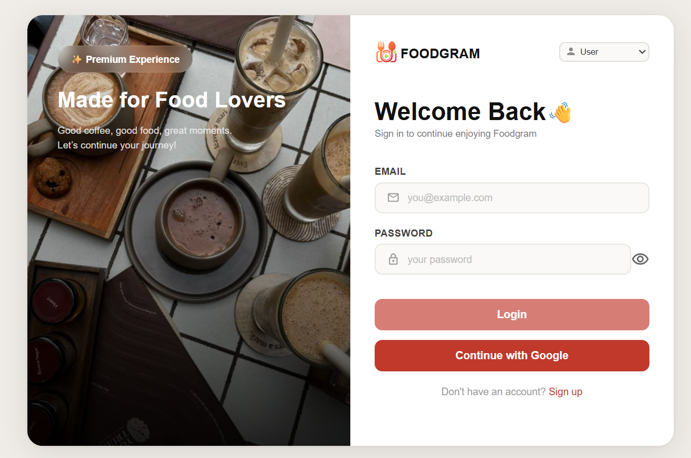
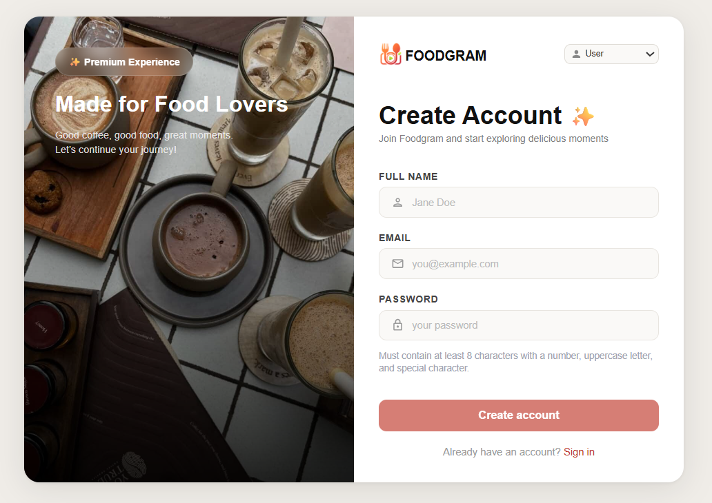
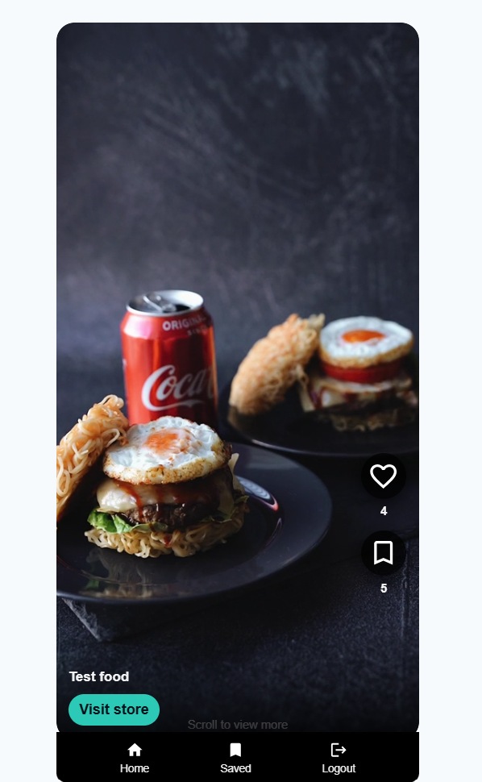
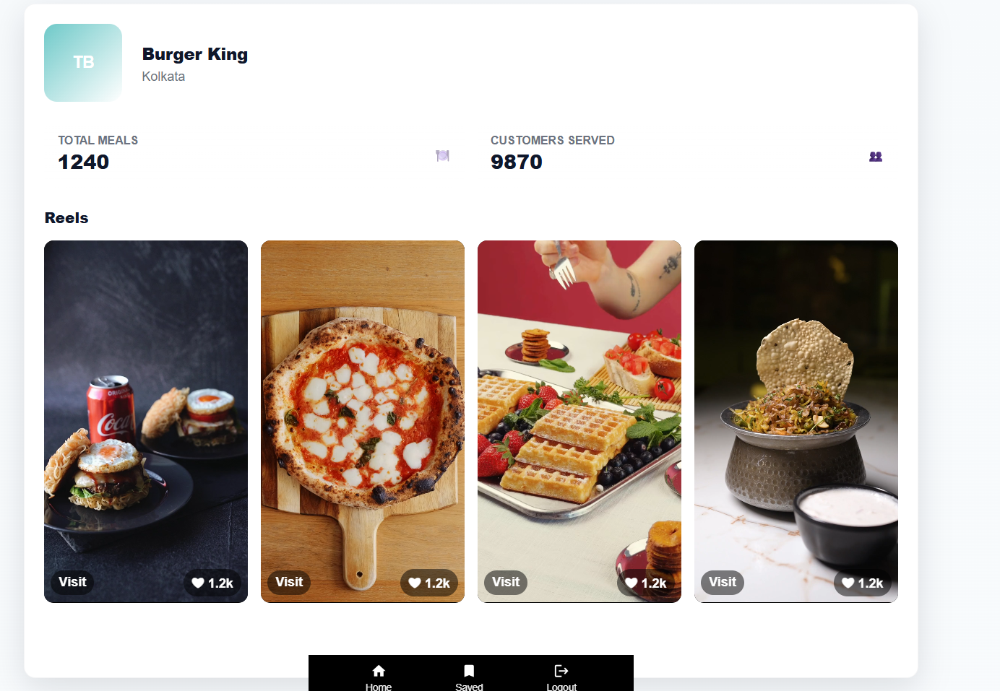
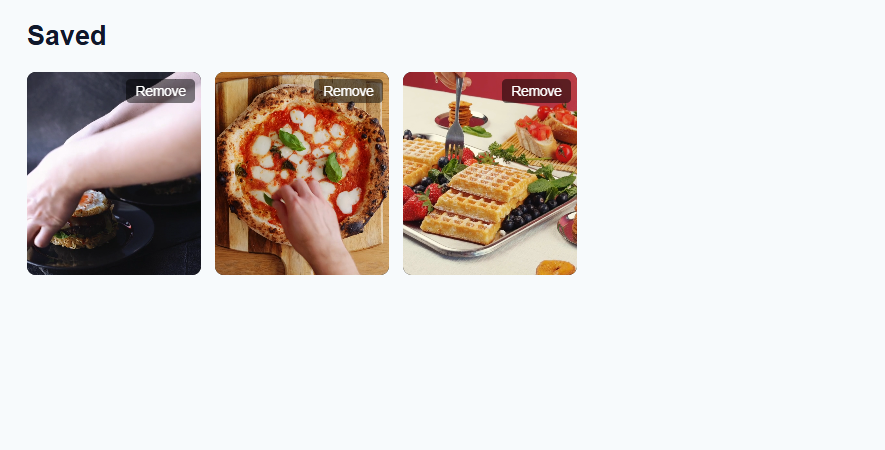

# FoodGram 🍔

FoodGram is a full-stack video-sharing web application, similar to TikTok or Instagram Reels, but focused on food. It allows users to discover food from local partners and for food partners to showcase their items.

---

## ✨ Features

* **Dual Authentication System:** Separate registration and login for "Users" and "Food Partners."
* **Video Reel Feed:** A scrollable, auto-playing feed of food videos (like Reels).
* **User Interaction:** Users can like and save their favorite food videos.
* **Partner Profiles:** Users can visit the profile pages of the food partners.
* **Video Upload:** Food partners can create and upload new food items/videos.

---
## 📸 Screenshots
### 🔐 Login Page
Users can securely log in using their credentials or Google authentication.


### 📝 Sign Up Page
New users can create an account using email/password or Google authentication to access the platform.


### 🍔 Food Reels Feed
Browse engaging food reels from local food partners and discover new restaurants.


### 🏪 Restaurant Details Page
View detailed information about a restaurant including its profile, uploaded food reels and offerings.



### ❤️ Saved Items
Access your collection of saved food reels for later viewing.


---

## 🛠️ Tech Stack

* **Frontend:** React, React Router, Axios, Material-UI Icons
* **Backend:** Node.js, Express.js
* **Database:** MongoDB (with Mongoose)
* **Authentication:** JSON Web Tokens (JWT)
* **File Storage:** ImageKit (for video uploads)

---

## 📂 Project Structure

Here is the high-level structure of the FoodGram application:

<pre>
FoodGram/
├── backend/
│   ├── controllers/
│   │   ├── auth.controller.js
│   │   ├── food.controller.js      
│   │   └── ...
│   ├── middleware/
│   │   └── auth.middleware.js
│   ├── models/
│   │   ├── user.model.js
│   │   ├── foodpartner.model.js
│   │   └── food.model.js
│   ├── routes/
│   │   ├── auth.routes.js
│   │   ├── food.routes.js
│   │   └── food-partner.routes.js
│   ├── .env.example
│   ├── app.js
│   ├── package.json
│   └── server.js
│
├── frontend/
│   ├── src/
│   │   ├── components/
│   │   │   └── BottomNavBar.jsx
│   │   ├── pages/
│   │   │   ├── general/
│   │   │   │   ├── Home.jsx
│   │   │   │   └── Saved.jsx
│   │   │   ├── food-partner/
│   │   │   │   ├── CreateFood.jsx
│   │   │   │   └── Profile.jsx
│   │   │   ├── UserLogin.jsx
│   │   │   ├── UserRegister.jsx
│   │   │   └── ...
│   │   ├── styles/
│   │   │   └── auth.css
│   │   ├── AppRoutes.jsx
│   │   └── main.jsx
│   ├── .env.example
│   ├── index.html
│   └── package.json
│
├── .gitignore
└── README.md
</pre>

## 🚀 Getting Started: 

Follow these instructions to get a copy of the project running on your local machine.

### Prerequisites

* Node.js (v18 or later)
* npm
* A MongoDB database (You can use a free [MongoDB Atlas](https://www.mongodb.com/cloud/atlas/register) cluster)

### ImageKit API Keys

Follow the steps below to access the ImageKit API keys necessary to run the project:
- Access the website at: https://imagekit.io/ .
- Click on "Sign Up" to make an account and fill in the details as necessary.
- Navigate to "Developer Options" on the left panel to retrieve all keys:


### Local Setup

1.  **Fork the repository:**
    Go to the [FoodGram GitHub repository](https://github.com/AshutoshRaj1260/FoodGram) and click the "Fork" button in the top right.

2.  **Clone your forked repository:**
    ```bash
    git clone [https://github.com/YOUR_GITHUB_USERNAME/FoodGram.git](https://github.com/YOUR_GITHUB_USERNAME/FoodGram.git)
    cd FoodGram
    ```
    (Replace `YOUR_GITHUB_USERNAME` with your actual GitHub username.)

3.  **Install Backend Dependencies:**
    ```bash
    cd backend
    npm install
    ```
    Create a `.env` file in the `backend` directory with the following variables:
    ```ini
    # Server configuration
    PORT=3000

    # Your MongoDB connection string
    MONGO_URI=your_mongodb_connection_string

    # A secret string for signing JWTs (recommended: at least 32 characters)
    JWT_SECRET=your_super_secret_key

    # Your frontend's local URL for CORS (Vite's default is 5173)
    FRONTEND_URL=http://localhost:5173

    # Your ImageKit credentials (for video uploads)
    IMAGEKIT_PRIVATE_KEY=your_imagekit_private_key
    IMAGEKIT_PUBLIC_KEY=your_imagekit_public_key
    IMAGEKIT_URL_ENDPOINT=https://ik.imagekit.io/your_imagekit_id/

    # Google OAuth Credentials
    GOOGLE_CLIENT_ID=your_google_client_id
    GOOGLE_CLIENT_SECRET=your_google_client_secret
    GOOGLE_CALLBACK_URL=http://localhost:3000/api/auth/google/callback
    ```

4.  **Install Frontend Dependencies:**
    ```bash
    cd ../frontend # Go back to the root, then into frontend
    npm install
    ```
    Create a `.env` file in the `frontend` directory with:
    ```ini
    # Your backend's API base URL (in production this can just be /api)
    VITE_API_URL=http://localhost:3000

    # The URL for Google Authentication redirect
    VITE_GOOGLE_AUTH_URL=http://localhost:3000/api/auth/google
    ```
---

## Running the Application

### Option 1: Local Development (Split Servers)
You will need two separate terminal windows for local development with hot reloading.

* **In Terminal 1 (Backend):**
    ```bash
    cd backend
    npm start # Or `nodemon server.js` if you have nodemon installed
    # The backend server should start on http://localhost:3000
    ```

* **In Terminal 2 (Frontend):**
    ```bash
    cd frontend
    npm run dev
    # The frontend application should be accessible at http://localhost:5173
    ```
    Open `http://localhost:5173` in your browser.

### Option 2: Local Production Build (Testing Deployment locally)
The application is structured to serve the frontend from the backend in production mode. You can test this locally:

1.  **Build the Frontend:**
    ```bash
    cd frontend
    npm run build
    ```
    This creates a `dist` folder populated with static assets.

2.  **Start the Backend Server:**
    ```bash
    cd ../backend
    npm start
    ```
    Now, opening `http://localhost:3000` will serve the fully built React frontend directly from the backend server!

--- 

## ☁️ Deployment (Render CI/CD)

> **⚠️ Note for Contributors:** Open-source contributors **do not** need to deploy the application on Render or any other hosting service. Please use the **Local Development** steps above to fork, run, test locally, and raise a PR. This deployment section is documented for the project administrator who manages the live production environment.

The application is configured to be deployed on Render using a **Web Service** acting as a single domain.

1.  Create a new Web Service on Render and connect your GitHub repository.
2.  **Build Command:** 
    ```bash
    cd frontend && npm install && npm run build && cd ../backend && npm install
    ```
3.  **Start Command:**
    ```bash
    cd backend && npm start
    ```
4.  Add all corresponding Environment Variables from both backend and frontend `.env` to the Render Dashboard environment.

--- 

## Contributing 

FoodGram is **actively looking for contributors**, built in the open, and every PR matters.

Read [CONTRIBUTING.md](CONTRIBUTING.md) for the full workflow, coding guidelines, and how to find
good first issues. Ensure all interactions follow the [CODE_OF_CONDUCT.md] (CODE_OF_CONDUCT.md).


```bash
git clone https://github.com/AshutoshRaj1260/FoodGram.git
cd FoodGram
```

## 🐳 Running with Docker (Recommended)

The easiest way to get FoodGram up and running is using Docker Compose. This will set up both the backend and frontend in containers.

### 1. Prerequisites
* [Docker](https://www.docker.com/products/docker-desktop/) installed on your machine.
* [Docker Compose](https://docs.docker.com/compose/install/) (usually included with Docker Desktop).

### 2. Environment Variables
Create `.env` files in both the `backend` and `frontend` directories by copying the provided examples:

**Backend:**
```bash
cp backend/.env.example backend/.env
```
Fill in your `MONGO_URI` (from MongoDB Atlas) and other credentials in `backend/.env`.

**Frontend:**
```bash
cp frontend/.env.example frontend/.env
```
Fill in the `VITE_API_URL` and `VITE_GOOGLE_AUTH_URL` in `frontend/.env`.

### 3. Run with Docker Compose
From the root of the project, run:

```bash
docker-compose up --build
```

The application will be available at:
*   **Frontend:** [http://localhost:5173](http://localhost:5173)
*   **Backend:** [http://localhost:3000](http://localhost:3000)

